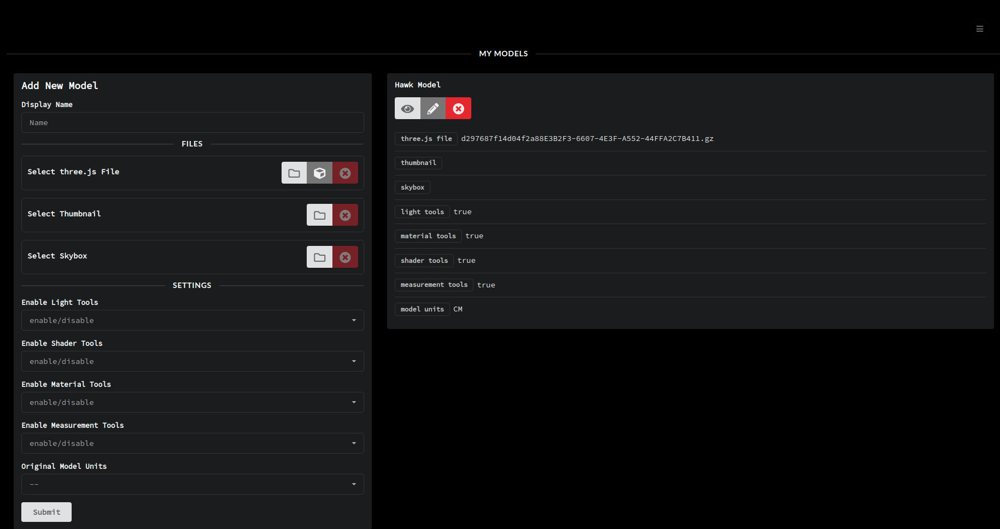
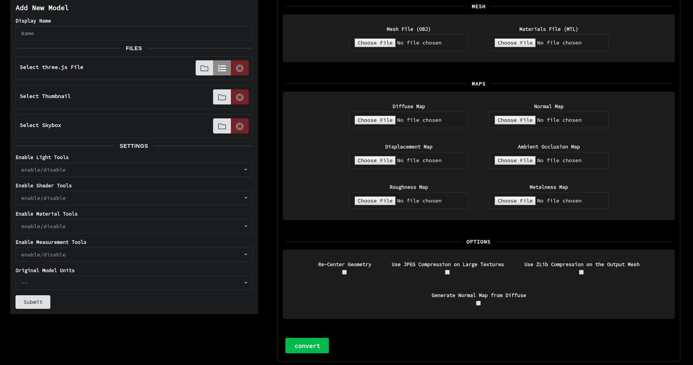
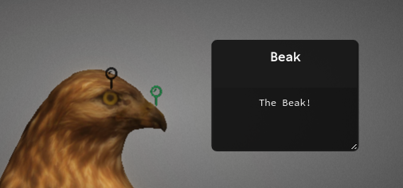
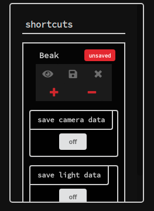

# Work in Progress Cultural Heritage 3D Viewer Platform
Built with React, Node, and three.js

## Dependencies

Node.js >= v8.9.0

npm >= 5.5.1

MongoDB >= v3.0

## Installation
Clone this repo and run:

`npm install-all`

to install both the server and client apps.

The server app requires 2 configuration files located in the server/ folder:

###### *privatekey.json*

Stores the private key used for JWT generation, eg:

```
{
  "key": "myprivatekey"
}
```

###### *email.json*
Stores the email configuration for the server app, eg:

```
{
  "verificationRoute": "http://localhost:3000/admin/verify/",
  "service": "gmail",
  "email": "myemail@gmail.com",
  "password": "mypassword"
}
```

service, email, and password are standard Nodemailer transport options. vertificationRoute is the client side (React Router) route that will be linked in the body of all verification e-mails. The user's verification token will be appended to that route.

An optional *config.js* file can be added to the server folder, allowing customization of both the MongoDB URL and the API server port:

```
const config = {
  mongoURL: process.env.MONGO_URL || 'mongodb://localhost:27017/mydb',
  port: process.env.PORT || 3001,
  basename: process.env.basename || '',
};

module.exports = config;

```

All of the above files have sample versions (i.e. sample-config.js) you can reference in the server folder.

##### To run in dev mode:

`npm run dev`

This runs the API server on localhost:3001 and the create-react-app dev server on localhost:3000. All API requests are proxied from port 3000 to 3001.

##### To run with a production build of the client app:
Change the "homepage" property in client/package.json in order to set process.env.PUBLIC_URL to the URL that the app will be served from, i.e.
"https://myapps/threejs-app".

Build the client app with the environment variable REACT_APP_API_URL to specify the API URL for the server app, i.e.

API_URL='https://myapps/threejs-server' npm run build

Follow the instructions in the terminal to deploy the client app.

## Usage

Follow the steps for creating an account by clicking the *sign up* button on the homepage.

Once you've logged in, you will be redirected to the admin interface:


From there you can open the converter interface by selecting the *open converter* icon: 

### Mesh Conversion
Resurrect3D stores all of its 3D data in three.js [JSON Model Format](https://github.com/mrdoob/three.js/wiki/JSON-Model-format-3). All geometry and texture data is embedded into a single GZipped JSON file. 

Supported Formats

Mesh Import Formats (Conversion Tools Only)
- [x] OBJ / MTL
- [ ] FBX
- [ ] COLLADA
- [ ] STL
- [ ] PLY

Texture Import Formats
- [x] JPEG
- [x] PNG (RGB and RGBA)
- [x] TIFF (Not recommended)
- [x] WebP (Chrome and Edge)
- [ ] EXR
- [ ] DDS

Mesh conversion is integrated into the admin interface, but can also be accessed at the */converter* route.


Mesh -- the mesh input files (OBJ and MTL)

Maps -- where you can upload all of your PBR maps. [Click here](https://threejs.org/docs/#api/en/materials/MeshStandardMaterial) for the full details on supported maps

##### Mesh Converter Options

| Option                           | Description                                                                                                                       |
|----------------------------------|-----------------------------------------------------------------------------------------------------------------------------------|
| Re-Center Geometry (recommended) | Centers the model in the viewer                                                                                                   |
| Use JPEG Compression ...         | Any maps > 2048x2048 are transcoded to jpegs regardless of their original format                                                  |
| Use zlib Compression ...         | Compresses the mesh and texture data using the deflate algorithm. Results in a .gz file. If unchecked, the output is a JSON file  |
| Normal Map from Diffuse          | A normal map is estimated based on the horizontal and vertical gradients of the diffuse texture. Can help to add detail to simplified meshes |

##### Settings Options

| Option                   | Description                                                                                                                                                                                                                                                            |
|--------------------------|------------------------------------------------------------------------------------------------------------------------------------------------------------------------------------------------------------------------------------------------------------------------|
| Enable Light Tools       | Allows users to move a dynamic point light around the scene. In addition to xyz properties, they can also control the intensity and color of the point light.                                                                                                          |
| Enable Shader Tools      | Allows users to control custom shaders to aid in viewing the object. For now these include [Eye-Dome Lighting](https://blog.kitware.com/eye-dome-lighting-a-non-photorealistic-shading-technique/) and [Chroma Key](https://en.wikipedia.org/wiki/Chroma_key) shaders. |
| Enable Material Tools   | Allows users to manipulate various material properties including metalness, roughness, and normal scale.                                                                                                                                                               |
| Enable Measurement Tools | Allows users to take interactive measurements of the object. Note, the object must be properly scaled in order for this to work correctly. For more info, see the "Original Model Units" option below.                                                                                |
| Original Model Units                    | The original unit of measurement the object was captured / scaled to. Please see the MeshLab tutorial ["Scaling to Real Measures"](https://www.youtube.com/watch?v=6psAppbOOXM) for more info.                                                                         |

#### PTM Conversion
Resurrect3D also supports [Polynomial Texture Mapping](https://en.wikipedia.org/wiki/Polynomial_texture_mapping) files. To convert a PTM file to JSON Model Format, use the PTM converter located at */ptm-converter*.

The PTM converter works the same way as the Mesh converter, but upon conversion you are given the option to download the resulting .gz file, which can be added to a model via the *Open File* button 

##### PTM Converter Options

| Option                           | Description                                                                                                                                                |
|----------------------------------|------------------------------------------------------------------------------------------------------------------------------------------------------------|
| Create Mesh from Surface Normals | Attempts to estimate depth from the surface normals extracted from the PTM. Produces a surface reconstruction as opposed to a flat plane. Results may vary |
| Use JPEG Compression ...         | Any maps > 2048x2048 are transcoded to jpegs regardless of their original format                                                                           |
| Use zlib Compression ...         | Compresses the mesh and texture data using the deflate algorithm. Results in a .gz file. If unchecked, the output is a JSON file                           |


##### NOTE
Some optimization attempts have been made with the conversion tools, and all processing is done in Web Workers wherever possible, but you may run into memory issues if you attempt to create normal maps from very large textures (>=8192x8192) on a below-average machine. Similarly, you may run into issues with very large PTM files (>300MB), and processing may take a few minutes.

#### Viewing Your Models
Models can be viewed at */models/:model_id*. To view a model from the admin interface, click the *View Model* button  on any of your existing models.

Models can also be embedded via an iframe. To point to an embeddable version of the model, use the route */embed/:model_id*.

##### NOTE 
Resurrect3D uses a caching system with Web Workers, and as of right now it needs to be disabled when embedded via an iframe. If you attempt to embed a model without using the */embed* route it will cause an error. 

#### Saving Tools Settings
A model's owner can save any of the tool settings (lights, shaders, materials) from the main viewer interface by clicking the *save tool settings* option on the toolbar. Once saved, all of these settings will be loaded when a user views the model.

#### Adding Annotations
To add annotations to a model, a user must a) be logged in and b) own the model they wish to annotate. When logged in, there will be an additional button under tools -- annotations:


When turned on, the user can pick a point on an object and add an annotation. Once the annotation is added, the title and body of the annotation can be edited via their respective text areas:



The annotation will also appear in the *shortcuts* section of the annotation toolbar:



From here the annotation can be viewed, saved, or discarded. When more than one annotation is added, the **+** and **-** buttons can be used to change the order in which the annotations appear in *presentation mode*. By selecting the *save camera data* or *save light data* options, the current camera position and light settings *at the time of saving* will be associated with the given annotation. These options can provide more control over how the model is displayed at a certain annotation.

#### Viewing Annotations
If any annotations are added to a model, any user can view an individual annotation by clicking the *view annotation* button:


Any user can also enter a fullscreen *presentation mode* by clicking the *Start Presentation* button.

##### Presentation Mode Controls

| Key         | Function                        |
|-------------|---------------------------------|
| Left Arrow  | Navigate to previous annotation |
| Right Arrow | Navigate to next annotation     |
| Escape      | Exit presentation mode          |

